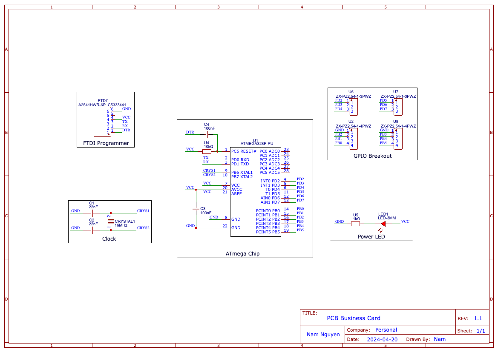

# PCB Business Card

This is my custom PCB business card. I wanted to learn more about PCB design so a decided to make a fully custom PCB that functions both as a microcontroller and a business card.

> Note: *PCB_biz-card_3* is the final version of this project. The other 2 were just me messing around with the EDA

This is how it looks like:

I used EasyEDA to design the board. This was a big learning experience for me so the design doesn't follow the best practices but for now, it's good enough. This is the schematic and x-ray view of the board:

# Plans

Current plan: Move project into KiCAD

I plan on improving on this design. Here's a couple bullet points on what I plan on improving:

- Add an NFC antenna
- Use SMD components (Right now, I don't really have good access to many SMD components so the components I use are all through-hole)
- Add 5V battery to provide energy for the MCU

# Credits

This project was inspired by these projects:

- Xander Naumenko's [PCB business card](https://github.com/misprit7/PCB-Business-Card)
- Anthony Kouttron's [PCB business card](https://github.com/anthonykouttron/pcb-business-card-qr-nfc)
- Badr Bouslikhin's [Enchanté card](https://github.com/badrbouslikhin/Enchante)

